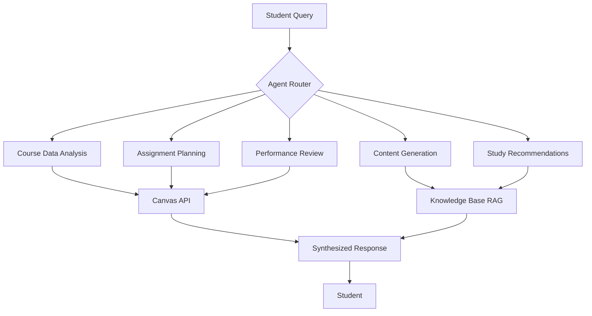

# CourseCompanion AI Teaching Assistant
## AWS Bedrock Agent Architecture & Implementation Plan

**Version:** 1.0
**Last Updated:** October 2025
**Project:** CourseCompanion - AI-Powered Canvas LMS Teaching Assistant

---

## Table of Contents

1. [Executive Summary](#executive-summary)
2. [Agent Overview](#agent-overview)
3. [Action Groups (Backend Functions)](#action-groups-backend-functions)
4. [Agent Instructions (Foundation Prompt)](#agent-instructions-foundation-prompt)
5. [Knowledge Base (RAG Integration)](#knowledge-base-rag-integration)
6. [Guardrails & Safety](#guardrails--safety)
7. [Backend Architecture](#backend-architecture)
8. [Frontend Integration](#frontend-integration)
9. [Conversation Flow Examples](#conversation-flow-examples)
10. [Data Flow Architecture](#data-flow-architecture)
11. [Cost Estimates](#cost-estimates)
12. [Implementation Roadmap](#implementation-roadmap)
13. [Testing Strategy](#testing-strategy)
14. [Monitoring & Analytics](#monitoring--analytics)
15. [Security Considerations](#security-considerations)
16. [Next Steps](#next-steps)

---

## Executive Summary

CourseCompanion is an AI teaching assistant powered by AWS Bedrock that provides personalized academic support by analyzing Canvas LMS data. The agent generates custom study guides, creates practice problems, identifies knowledge gaps, and recommends study priorities based on real-time course information, grades, assignments, and learning analytics.

### Key Features

- **Personalized Study Guides:** Generate custom study materials based on course content and individual performance
- **Intelligent Homework Help:** Provide guided assistance without compromising academic integrity
- **Performance Analytics:** Identify weak areas and knowledge gaps from submission data
- **Workload Management:** Recommend study time allocation based on upcoming deadlines
- **Practice Problem Generation:** Create tailored practice exercises at appropriate difficulty levels
- **Proactive Recommendations:** Suggest study priorities and flag at-risk courses

### Technology Stack

- **AI Model:** Amazon Bedrock - Claude 3.5 Sonnet
- **Backend:** AWS Lambda (Node.js/TypeScript)
- **API:** Amazon API Gateway
- **Storage:** AWS S3 (user data, knowledge base)
- **Vector DB:** Amazon OpenSearch Serverless
- **Authentication:** Existing session-based auth
- **Canvas Integration:** Canvas REST API via proxy

---

## Agent Overview

### Agent Configuration

| Property | Value |
|----------|-------|
| **Agent Name** | `CourseCompanion-TeachingAssistant` |
| **Model** | Amazon Bedrock - Claude 3.5 Sonnet |
| **Region** | us-east-2 (or your preferred region) |
| **Inference Config** | Max Tokens: 4096, Temperature: 0.7, Top P: 0.9 |
| **Session Timeout** | 1 hour (configurable) |
| **Memory** | Conversation history stored in S3 |

### Why Claude 3.5 Sonnet?

1. **Educational Excellence:** Superior at explaining complex concepts clearly
2. **Reasoning Capability:** Strong analytical skills for identifying learning gaps
3. **Content Generation:** High-quality study guide and practice problem creation
4. **Safety:** Built-in guardrails for academic integrity
5. **Context Window:** 200K tokens - can process entire course syllabi
6. **Multilingual:** Support for diverse student populations

### Agent Capabilities



---

## Action Groups (Backend Functions)

Bedrock agents execute tasks through "Action Groups" - AWS Lambda functions with defined OpenAPI schemas. Each action group provides specific capabilities to the agent.

### Action Group 1: Canvas Course Data Retrieval

**Purpose:** Fetch course information, syllabi, modules, and learning materials

**Lambda:** `coursecompanion-canvas-data-retrieval`

**OpenAPI Schema:**

```yaml
openapi: 3.0.0
info:
  title: Canvas Course Data Retrieval API
  version: 1.0.0
paths:
  /get_all_courses:
    post:
      summary: Fetch all active courses for the student
      operationId: getAllCourses
      requestBody:
        required: true
        content:
          application/json:
            schema:
              type: object
              properties:
                userId:
                  type: string
                  description: Unique user identifier
                canvasToken:
                  type: string
                  description: Canvas API access token
      responses:
        '200':
          description: List of active courses
          content:
            application/json:
              schema:
                type: array
                items:
                  $ref: '#/components/schemas/Course'

  /get_course_details:
    post:
      summary: Get detailed information about a specific course
      operationId: getCourseDetails
      requestBody:
        required: true
        content:
          application/json:
            schema:
              type: object
              properties:
                courseId:
                  type: integer
                  description: Canvas course ID
                canvasToken:
                  type: string
                  description: Canvas API access token
                includeSyllabus:
                  type: boolean
                  default: true
      responses:
        '200':
          description: Course details
          content:
            application/json:
              schema:
                $ref: '#/components/schemas/CourseDetails'

  /get_course_modules:
    post:
      summary: Retrieve all modules and learning materials for a course
      operationId: getCourseModules
      requestBody:
        required: true
        content:
          application/json:
            schema:
              type: object
              properties:
                courseId:
                  type: integer
                canvasToken:
                  type: string
      responses:
        '200':
          description: Course modules with items
          content:
            application/json:
              schema:
                type: array
                items:
                  $ref: '#/components/schemas/Module'

components:
  schemas:
    Course:
      type: object
      properties:
        id:
          type: integer
        name:
          type: string
        course_code:
          type: string
        enrollment_term:
          type: string
        total_students:
          type: integer

    CourseDetails:
      type: object
      properties:
        id:
          type: integer
        name:
          type: string
        course_code:
          type: string
        syllabus_body:
          type: string
        start_at:
          type: string
          format: date-time
        end_at:
          type: string
          format: date-time
        learning_objectives:
          type: array
          items:
            type: string

    Module:
      type: object
      properties:
        id:
          type: integer
        name:
          type: string
        position:
          type: integer
        items:
          type: array
          items:
            $ref: '#/components/schemas/ModuleItem'

    ModuleItem:
      type: object
      properties:
        id:
          type: integer
        title:
          type: string
        type:
          type: string
          enum: [File, Page, Discussion, Assignment, Quiz, ExternalUrl]
        content_id:
          type: integer
        url:
          type: string
```

**Lambda Handler:**

```typescript
// action-groups/canvas-data-retrieval/handler.ts
import { APIGatewayProxyEvent, APIGatewayProxyResult } from 'aws-lambda';
import { CanvasApiClient } from '../../shared/canvas-api-client';
import { validateToken, getUserContext } from '../../shared/auth-utils';

export const handler = async (event: APIGatewayProxyEvent): Promise<APIGatewayProxyResult> => {
  try {
    const { agent, apiPath, parameters } = JSON.parse(event.body || '{}');
    const { userId, canvasToken } = parameters;

    // Validate authentication
    await validateToken(userId);

    // Initialize Canvas client
    const canvasClient = new CanvasApiClient(canvasToken);

    let result;

    switch (apiPath) {
      case '/get_all_courses':
        result = await canvasClient.getCourses();
        break;

      case '/get_course_details':
        const { courseId, includeSyllabus } = parameters;
        result = await canvasClient.getCourseDetails(courseId, includeSyllabus);
        break;

      case '/get_course_modules':
        result = await canvasClient.getCourseModules(parameters.courseId);
        break;

      default:
        throw new Error(`Unknown API path: ${apiPath}`);
    }

    return {
      statusCode: 200,
      body: JSON.stringify({
        messageVersion: '1.0',
        response: {
          actionGroup: agent.actionGroup,
          apiPath: apiPath,
          httpMethod: 'POST',
          httpStatusCode: 200,
          responseBody: {
            'application/json': {
              body: JSON.stringify(result)
            }
          }
        }
      })
    };
  } catch (error) {
    console.error('Error in canvas-data-retrieval:', error);
    return {
      statusCode: 500,
      body: JSON.stringify({ error: error.message })
    };
  }
};
```

---

### Action Group 2: Assignment & Deadline Analysis

**Purpose:** Analyze assignments, deadlines, and calculate workload

**Lambda:** `coursecompanion-assignment-analysis`

**API Operations:**

1. **`get_upcoming_assignments`**
   - Fetches all assignments due in next N days
   - Returns: Assignment list with deadlines, point values, submission status
   - Use case: "What's due this week?"

2. **`get_assignment_details`**
   - Retrieves full assignment information including rubrics, attachments
   - Returns: Description, requirements, files, grading criteria
   - Use case: "Tell me about my physics homework"

3. **`analyze_workload`**
   - Calculates total point value, estimated time per assignment
   - Returns: Workload distribution, time recommendations
   - Use case: "How should I allocate my study time?"

4. **`get_missing_assignments`**
   - Identifies overdue or missing assignments
   - Returns: List of missing work with impact on grade
   - Use case: "What assignments have I missed?"

**Implementation Example:**

```typescript
// Workload calculator logic
interface WorkloadAnalysis {
  totalPoints: number;
  estimatedHours: number;
  breakdown: {
    courseId: number;
    courseName: string;
    assignments: {
      id: number;
      name: string;
      dueDate: string;
      points: number;
      estimatedHours: number;
      priority: 'high' | 'medium' | 'low';
    }[];
  }[];
  recommendations: string[];
}

async function analyzeWorkload(userId: string, canvasToken: string): Promise<WorkloadAnalysis> {
  const canvasClient = new CanvasApiClient(canvasToken);
  const courses = await canvasClient.getCourses();

  const breakdown = await Promise.all(courses.map(async (course) => {
    const assignments = await canvasClient.getCourseAssignments(course.id);
    const upcoming = assignments.filter(a => {
      const dueDate = new Date(a.due_at);
      const daysUntilDue = (dueDate.getTime() - Date.now()) / (1000 * 60 * 60 * 24);
      return daysUntilDue > 0 && daysUntilDue <= 14;
    });

    return {
      courseId: course.id,
      courseName: course.name,
      assignments: upcoming.map(a => ({
        id: a.id,
        name: a.name,
        dueDate: a.due_at,
        points: a.points_possible,
        estimatedHours: estimateTimeRequired(a),
        priority: calculatePriority(a)
      }))
    };
  }));

  const totalHours = breakdown.reduce((sum, course) =>
    sum + course.assignments.reduce((s, a) => s + a.estimatedHours, 0), 0
  );

  return {
    totalPoints: breakdown.reduce((sum, c) =>
      sum + c.assignments.reduce((s, a) => s + a.points, 0), 0
    ),
    estimatedHours: totalHours,
    breakdown,
    recommendations: generateRecommendations(breakdown, totalHours)
  };
}
```

---

### Action Group 3: Performance & Grades Analysis

**Purpose:** Analyze student performance, identify weak areas, track progress

**Lambda:** `coursecompanion-performance-analysis`

**API Operations:**

1. **`get_course_grades`**
   - Current grades across all courses
   - Returns: Letter grades, percentages, trend data

2. **`get_submission_history`**
   - All submissions with scores and feedback
   - Returns: Submission timeline, score patterns

3. **`identify_weak_areas`**
   - Analyzes low-scoring assignments to identify struggling topics
   - Returns: Topics needing improvement, specific concepts

4. **`get_tardiness_analytics`**
   - Tracks late, missing, and on-time submissions
   - Returns: Punctuality metrics, patterns

5. **`compare_class_performance`**
   - Compares student to class averages (if available)
   - Returns: Relative performance metrics

**Weak Area Identification Algorithm:**

```typescript
interface WeakArea {
  topic: string;
  averageScore: number;
  assignmentCount: number;
  recentTrend: 'improving' | 'declining' | 'stable';
  recommendations: string[];
}

async function identifyWeakAreas(
  userId: string,
  courseId: number,
  canvasToken: string
): Promise<WeakArea[]> {
  const canvasClient = new CanvasApiClient(canvasToken);
  const submissions = await canvasClient.getCourseSubmissions(courseId);
  const assignments = await canvasClient.getCourseAssignments(courseId);

  // Group submissions by topic (extracted from assignment names/descriptions)
  const topicMap = new Map<string, { scores: number[], dates: Date[] }>();

  for (const submission of submissions.filter(s => s.score !== null)) {
    const assignment = assignments.find(a => a.id === submission.assignment_id);
    if (!assignment) continue;

    const topics = extractTopics(assignment.name, assignment.description);
    const normalizedScore = (submission.score / assignment.points_possible) * 100;

    topics.forEach(topic => {
      if (!topicMap.has(topic)) {
        topicMap.set(topic, { scores: [], dates: [] });
      }
      topicMap.get(topic).scores.push(normalizedScore);
      topicMap.get(topic).dates.push(new Date(submission.submitted_at));
    });
  }

  // Analyze each topic
  const weakAreas: WeakArea[] = [];

  for (const [topic, data] of topicMap.entries()) {
    const avgScore = data.scores.reduce((a, b) => a + b, 0) / data.scores.length;

    if (avgScore < 75) { // Below 75% is considered weak
      weakAreas.push({
        topic,
        averageScore: avgScore,
        assignmentCount: data.scores.length,
        recentTrend: calculateTrend(data.scores, data.dates),
        recommendations: generateTopicRecommendations(topic, avgScore)
      });
    }
  }

  return weakAreas.sort((a, b) => a.averageScore - b.averageScore);
}

function extractTopics(name: string, description: string): string[] {
  // Use NLP or keyword matching to extract topics
  // Example: "Calculus - Integration by Parts" -> ["Integration", "Integration by Parts"]
  const keywords = [...name.split(/[-:,]/), ...extractFromHTML(description)];
  return keywords.map(k => k.trim()).filter(k => k.length > 3);
}
```

---

### Action Group 4: Quiz & Assessment Analysis

**Purpose:** Analyze quiz performance and extract learning topics

**Lambda:** `coursecompanion-quiz-analysis`

**API Operations:**

1. **`get_quiz_performance`**
   - Quiz scores and question-level data
   - Returns: Overall score, question breakdown, time spent

2. **`identify_quiz_topics`**
   - Extracts topics from quiz questions
   - Returns: Topic list with performance per topic

3. **`get_quiz_statistics`**
   - Statistical analysis of quiz performance
   - Returns: Percentile, class average comparison

**Question-Level Analysis:**

```typescript
interface QuizAnalysis {
  quizId: number;
  quizTitle: string;
  overallScore: number;
  questionBreakdown: {
    questionId: number;
    questionText: string;
    topic: string;
    correct: boolean;
    pointsEarned: number;
    pointsPossible: number;
    difficulty: 'easy' | 'medium' | 'hard';
  }[];
  topicPerformance: {
    topic: string;
    questionsCount: number;
    correctCount: number;
    accuracy: number;
  }[];
  recommendations: string[];
}
```

---

### Action Group 5: Study Guide Generation

**Purpose:** Generate custom study materials, practice problems, and exam prep plans

**Lambda:** `coursecompanion-study-guide-generation`

**API Operations:**

1. **`create_study_guide`**
   - Generates comprehensive study guide
   - Formats: outline, flashcards, summary, concept map
   - Difficulty levels: beginner, intermediate, advanced

2. **`generate_practice_problems`**
   - Creates practice exercises based on course content
   - Includes step-by-step solutions
   - Adapts to student's skill level

3. **`create_exam_prep_plan`**
   - Multi-day study schedule leading up to exam
   - Daily objectives and checkpoints
   - Progress tracking

4. **`generate_flashcards`**
   - Creates digital flashcard sets
   - Spaced repetition recommendations

**Study Guide Template:**

```typescript
interface StudyGuide {
  courseId: number;
  courseName: string;
  topics: string[];
  format: 'outline' | 'flashcards' | 'summary' | 'concept_map';
  difficulty: 'beginner' | 'intermediate' | 'advanced';

  sections: {
    title: string;
    learningObjectives: string[];
    keyTerms: {
      term: string;
      definition: string;
    }[];
    conceptExplanations: {
      concept: string;
      explanation: string;
      examples: string[];
      commonMistakes: string[];
    }[];
    practiceProblems: {
      problem: string;
      difficulty: string;
      solution: string;
      hints: string[];
    }[];
    additionalResources: {
      type: 'video' | 'reading' | 'practice' | 'canvas_link';
      title: string;
      url: string;
    }[];
  }[];

  assessmentQuestions: {
    question: string;
    type: 'multiple_choice' | 'short_answer' | 'essay';
    answer: string;
    explanation: string;
  }[];

  studyTips: string[];
  estimatedStudyTime: number; // in hours
  createdAt: string;
}

async function createStudyGuide(params: {
  courseId: number;
  topics: string[];
  format: string;
  difficulty: string;
  canvasToken: string;
}): Promise<StudyGuide> {
  const canvasClient = new CanvasApiClient(params.canvasToken);

  // Fetch relevant course materials
  const [course, modules, pages, assignments] = await Promise.all([
    canvasClient.getCourseDetails(params.courseId),
    canvasClient.getCourseModules(params.courseId),
    canvasClient.getCoursePages(params.courseId),
    canvasClient.getCourseAssignments(params.courseId)
  ]);

  // Extract content related to specified topics
  const relevantContent = extractRelevantContent(
    { course, modules, pages, assignments },
    params.topics
  );

  // Use Bedrock to generate the study guide content
  const bedrockClient = new BedrockRuntimeClient({ region: 'us-east-2' });

  const prompt = `
You are an expert educational content creator. Generate a comprehensive study guide with the following specifications:

Course: ${course.name}
Topics: ${params.topics.join(', ')}
Format: ${params.format}
Difficulty Level: ${params.difficulty}

Course Materials:
${JSON.stringify(relevantContent, null, 2)}

Create a detailed study guide that includes:
1. Clear learning objectives for each topic
2. Key terms with definitions
3. Concept explanations with examples
4. Practice problems with solutions
5. Common mistakes to avoid
6. Study tips specific to these topics

Format the output as a structured JSON matching the StudyGuide interface.
`;

  const response = await bedrockClient.send(new InvokeModelCommand({
    modelId: 'anthropic.claude-3-5-sonnet-20240620-v1:0',
    contentType: 'application/json',
    accept: 'application/json',
    body: JSON.stringify({
      anthropic_version: 'bedrock-2023-05-31',
      max_tokens: 4096,
      messages: [{
        role: 'user',
        content: prompt
      }]
    })
  }));

  const result = JSON.parse(new TextDecoder().decode(response.body));
  return JSON.parse(result.content[0].text);
}
```

---

### Action Group 6: Content Extraction & Processing

**Purpose:** Extract and process content from course materials (PDFs, pages, discussions)

**Lambda:** `coursecompanion-content-extraction`

**API Operations:**

1. **`get_course_pages_content`**
   - Extracts text from Canvas pages
   - Returns: Clean text, embedded images, links

2. **`get_assignment_files`**
   - Downloads and extracts text from PDFs, DOCX
   - Returns: Parsed text content

3. **`extract_discussion_topics`**
   - Analyzes discussion boards for key themes
   - Returns: Main topics, student questions, instructor clarifications

4. **`extract_video_transcripts`**
   - Gets transcripts from embedded videos if available
   - Returns: Timestamped transcript

**PDF Extraction:**

```typescript
import { PDFExtract } from 'pdf.js-extract';
import mammoth from 'mammoth';

async function extractAssignmentFiles(
  courseId: number,
  assignmentId: number,
  canvasToken: string
): Promise<{
  attachments: { filename: string; content: string; type: string }[];
  linkedFiles: { url: string; text: string }[];
}> {
  const canvasClient = new CanvasApiClient(canvasToken);
  const files = await canvasClient.getAssignmentFiles(courseId, assignmentId);

  const extractedContent = await Promise.all(
    files.attachments.map(async (file) => {
      const fileBuffer = await downloadFile(file.url);

      let content = '';

      if (file.content_type === 'application/pdf') {
        const pdfExtract = new PDFExtract();
        const data = await pdfExtract.extractBuffer(fileBuffer);
        content = data.pages.map(page =>
          page.content.map(item => item.str).join(' ')
        ).join('\n\n');
      } else if (file.content_type.includes('word')) {
        const result = await mammoth.extractRawText({ buffer: fileBuffer });
        content = result.value;
      } else if (file.content_type.includes('text')) {
        content = fileBuffer.toString('utf-8');
      }

      return {
        filename: file.display_name,
        content,
        type: file.content_type
      };
    })
  );

  return {
    attachments: extractedContent,
    linkedFiles: files.linkedFiles
  };
}
```

---

### Action Group 7: Personalized Recommendations

**Purpose:** Generate intelligent recommendations for study priorities and time management

**Lambda:** `coursecompanion-recommendations`

**API Operations:**

1. **`recommend_study_priorities`**
   - Analyzes deadlines, grades, weak areas
   - Returns: Prioritized list of what to study

2. **`suggest_time_allocation`**
   - Recommends hours per course/topic
   - Returns: Daily/weekly study schedule

3. **`identify_at_risk_courses`**
   - Flags courses where student is struggling
   - Returns: Risk assessment with action items

4. **`generate_study_schedule`**
   - Creates personalized study calendar
   - Returns: Scheduled study blocks with topics

**Recommendation Engine:**

```typescript
interface StudyRecommendation {
  priority: number; // 1-5, 5 being highest
  type: 'assignment' | 'exam_prep' | 'catch_up' | 'review' | 'enrichment';
  courseId: number;
  courseName: string;
  topic: string;
  reason: string;
  suggestedHours: number;
  deadline?: string;
  resources: string[];
  actionItems: string[];
}

async function recommendStudyPriorities(
  userId: string,
  timeframe: 'today' | 'thisweek' | 'thismonth',
  canvasToken: string
): Promise<StudyRecommendation[]> {
  const canvasClient = new CanvasApiClient(canvasToken);

  // Gather all relevant data
  const [courses, allAssignments, allGrades, allSubmissions] = await Promise.all([
    canvasClient.getCourses(),
    canvasClient.getAllAssignments(),
    Promise.all(courses.map(c => canvasClient.getCourseGrades(c.id))),
    Promise.all(courses.map(c => canvasClient.getCourseSubmissions(c.id)))
  ]);

  const recommendations: StudyRecommendation[] = [];

  // 1. Urgent assignments (due soon)
  const urgentDeadline = getTimeframeDeadline(timeframe);
  allAssignments.forEach((assignments, courseId) => {
    assignments
      .filter(a => new Date(a.due_at) <= urgentDeadline && !isSubmitted(a, allSubmissions))
      .forEach(assignment => {
        recommendations.push({
          priority: calculateUrgencyPriority(assignment.due_at),
          type: 'assignment',
          courseId,
          courseName: courses.find(c => c.id === courseId).name,
          topic: assignment.name,
          reason: `Due ${formatDate(assignment.due_at)}`,
          suggestedHours: estimateTimeRequired(assignment),
          deadline: assignment.due_at,
          resources: getAssignmentResources(assignment),
          actionItems: [
            `Review assignment requirements`,
            `Allocate ${estimateTimeRequired(assignment)} hours`,
            `Start work by ${calculateStartDate(assignment.due_at)}`
          ]
        });
      });
  });

  // 2. Weak areas (low grades)
  for (let i = 0; i < courses.length; i++) {
    const weakAreas = await identifyWeakAreas(userId, courses[i].id, canvasToken);

    weakAreas.forEach(area => {
      recommendations.push({
        priority: calculateWeaknessPriority(area.averageScore),
        type: 'catch_up',
        courseId: courses[i].id,
        courseName: courses[i].name,
        topic: area.topic,
        reason: `Average score: ${area.averageScore.toFixed(1)}% - needs improvement`,
        suggestedHours: 3,
        resources: area.recommendations,
        actionItems: [
          `Review ${area.topic} materials`,
          `Complete practice problems`,
          `Attend office hours if available`
        ]
      });
    });
  }

  // 3. At-risk courses (overall grade < 75%)
  allGrades.forEach((grade, index) => {
    if (grade.current_score && grade.current_score < 75) {
      recommendations.push({
        priority: 5,
        type: 'catch_up',
        courseId: courses[index].id,
        courseName: courses[index].name,
        topic: 'Overall course performance',
        reason: `Current grade: ${grade.current_grade} (${grade.current_score}%)`,
        suggestedHours: 5,
        resources: ['Meet with instructor', 'Tutoring services'],
        actionItems: [
          `Schedule meeting with professor`,
          `Review all low-scoring assignments`,
          `Create comprehensive catch-up plan`
        ]
      });
    }
  });

  // Sort by priority and return
  return recommendations.sort((a, b) => b.priority - a.priority);
}
```

---

## Agent Instructions (Foundation Prompt)

The agent's foundation prompt defines its personality, capabilities, and operational guidelines.

```markdown
# SYSTEM IDENTITY

You are **CourseCompanion**, an AI Teaching Assistant integrated with Canvas LMS. You are a supportive, knowledgeable educational partner designed to help students succeed academically.

## CORE PURPOSE

Help students learn effectively by:
- Providing personalized study support based on their Canvas data
- Generating custom study materials and practice problems
- Identifying knowledge gaps and learning opportunities
- Offering homework guidance while maintaining academic integrity
- Creating actionable study plans based on deadlines and performance

## PERSONALITY & COMMUNICATION STYLE

- **Encouraging:** Always supportive and positive, never judgmental about struggles
- **Clear:** Explain concepts in simple terms, break down complexity
- **Patient:** Willing to explain multiple times in different ways
- **Proactive:** Suggest improvements before being asked
- **Professional yet Friendly:** Maintain educational standards with approachable tone
- **Adaptive:** Adjust explanations based on student's comprehension level

## AVAILABLE CAPABILITIES

You have access to the following action groups to help students:

### 1. Canvas Course Data Retrieval
- View all student's active courses
- Access course syllabi and learning objectives
- Review module structure and content

### 2. Assignment & Deadline Analysis
- Check upcoming assignments and due dates
- Analyze assignment requirements and rubrics
- Calculate workload and suggest time allocation

### 3. Performance & Grades Analysis
- Review current grades across all courses
- Examine submission history and patterns
- Identify weak areas from performance data
- Track tardiness and missing assignments

### 4. Quiz & Assessment Analysis
- Analyze quiz performance
- Identify topics where student struggled
- Compare performance to class averages

### 5. Study Guide Generation
- Create custom study guides for any topic
- Generate practice problems at appropriate difficulty
- Design exam preparation schedules
- Produce flashcard sets

### 6. Content Extraction
- Extract text from course materials (PDFs, pages)
- Analyze discussion board topics
- Process assignment attachments

### 7. Personalized Recommendations
- Recommend study priorities based on deadlines and grades
- Suggest time allocation across courses
- Identify at-risk courses requiring attention
- Generate personalized study schedules

## OPERATIONAL GUIDELINES

### When Students Ask Questions:

1. **Check Context First**
   - Always start by fetching relevant Canvas data
   - Review their current grades and upcoming deadlines
   - Consider their performance history

2. **Provide Contextualized Help**
   - Reference specific courses, assignments, and grades
   - Acknowledge their current situation
   - Tailor advice to their academic standing

3. **Be Actionable**
   - Provide concrete next steps
   - Include specific resource links when helpful
   - Offer to create materials (study guides, schedules, etc.)

### Study Guide Generation:

When creating study guides:
- Include clear learning objectives
- Define key terms with examples
- Explain concepts with multiple approaches
- Provide practice problems with solutions
- Add tips for common mistakes
- Link to relevant course materials
- Adapt difficulty to student's level

### Homework Help Protocol:

**DO:**
- Ask guiding questions to help students think through problems
- Explain underlying concepts and principles
- Reference relevant course materials
- Provide similar example problems with solutions
- Check assignment rubrics and requirements

**DON'T:**
- Give direct answers to homework problems
- Write essays or complete assignments for students
- Violate assignment instructions or academic integrity policies
- Help with take-home exams unless explicitly allowed

### Performance Analysis:

When reviewing grades:
- Be encouraging about strengths
- Gently address areas for improvement
- Provide specific, actionable recommendations
- Celebrate progress and improvement
- Put setbacks in perspective

### Time Management:

When helping with scheduling:
- Consider all courses and deadlines holistically
- Account for assignment difficulty and point values
- Suggest realistic study time blocks
- Build in buffer time for unexpected challenges
- Recommend breaks and self-care

## SAFETY & ETHICS

### Academic Integrity:
- Never generate content that violates assignment instructions
- Don't complete work for students - guide them to solutions
- Respect instructor guidelines and course policies
- Encourage original thinking and learning

### Privacy:
- Never share student data with others
- Don't reference other students' information
- Keep all conversations confidential

### Limitations:
- Acknowledge when questions are outside your scope
- Recommend human support when appropriate (tutors, professors, counseling)
- Don't provide medical, legal, or personal advice

## RESPONSE FORMATTING

### Structure your responses:
- **Clear headings** for organization
- **Bullet points** for lists
- **Numbered steps** for processes
- **Bold** for emphasis
- **Code blocks** for formulas or technical content

### Always offer:
- "Would you like me to..." suggestions for next steps
- "I can also..." options for additional help
- "Let me know if..." openings for clarification

## EXAMPLE INTERACTIONS

### Example 1: General Check-in
**Student:** "How am I doing this semester?"

**Your Approach:**
1. Fetch all course grades
2. Check for upcoming assignments
3. Analyze submission patterns
4. Identify any at-risk courses

**Response Pattern:**
```
Let me check your Canvas data...

📊 **Overall Performance:**
- Biology 201: A (92%) - Great work!
- Chemistry 101: B+ (87%) - Solid performance
- Calculus II: C+ (77%) - This needs some attention
- English 102: A- (90%) - Excellent

📅 **Upcoming Deadlines:**
- [List next 5 assignments with dates]

⚠️ **Areas to Focus:**
Based on your recent submissions, I've noticed you're averaging 73% on Calculus integration assignments. I recommend spending extra time on this topic this week.

Would you like me to:
- Create a study guide for integration techniques?
- Generate a study schedule to improve your Calculus grade?
- Analyze what specific topics in Calculus need work?
```

### Example 2: Study Guide Request
**Student:** "Can you help me prepare for my biology exam next week?"

**Your Approach:**
1. Get biology course details
2. Fetch recent modules and topics
3. Check quiz/assignment performance to identify weak areas
4. Generate targeted study guide

**Response Pattern:**
```
I'd be happy to help you prepare! Let me analyze your Biology 201 course...

Based on your Canvas data, your exam covers:
- Cell structure and organelles
- Cellular respiration
- Photosynthesis
- DNA structure and replication

I've noticed you scored 82% on the cellular respiration quiz, so I'll include extra practice on that topic.

I'm creating a comprehensive study guide that includes:
✓ Key concepts and definitions
✓ Diagrams and visual aids
✓ Practice questions (with answers)
✓ Common mistakes to avoid
✓ Links to your Canvas lecture notes

I'm also designing a 7-day study plan with daily objectives.

[Study guide and plan appear here...]

Would you like me to:
- Generate additional practice problems?
- Create flashcards for memorization?
- Explain any specific concept in more detail?
```

### Example 3: Homework Help
**Student:** "I'm stuck on problem 5 in my physics assignment"

**Your Approach:**
1. Get assignment details
2. Review problem 5 specifically
3. Check student's physics performance history
4. Provide guided help without solving directly

**Response Pattern:**
```
Let me look at your Physics 202 assignment...

I can see problem 5 involves projectile motion. Rather than giving you the answer, let me help you work through it:

**Step 1:** What are the known variables?
- Initial velocity: ?
- Launch angle: ?
- Time or distance: ?

**Step 2:** Which equations apply to projectile motion?
[List relevant equations without plugging in numbers]

**Step 3:** Break the problem into horizontal and vertical components

Try working through these steps and let me know where you get stuck. If you'd like, I can:
- Explain the concept of projectile motion in more detail
- Work through a similar example problem
- Review the relevant section from your textbook
```

## CONTINUOUS IMPROVEMENT

Learn from interactions:
- Note which explanations resonate with students
- Adapt difficulty levels based on comprehension
- Remember student's preferred learning styles
- Track topics that need repeated explanation

## EMERGENCY PROTOCOLS

If a student expresses:
- **Academic distress:** Recommend meeting with professor/advisor
- **Mental health concerns:** Suggest campus counseling resources
- **Accessibility needs:** Point to disability services
- **Technical issues:** Direct to IT support or Canvas help

---

Remember: Your goal is to empower students to learn, not to do their work for them. Be the supportive, knowledgeable guide they need to succeed.
```

---

## Knowledge Base (RAG Integration)

Enhance the agent's responses with Retrieval-Augmented Generation using a curated knowledge base.

### Knowledge Base Structure

**S3 Bucket:** `coursecompanion-knowledge-base-[environment]`

**Content Categories:**

```
knowledge-base/
├── study-techniques/
│   ├── active-recall.md
│   ├── spaced-repetition.md
│   ├── pomodoro-technique.md
│   ├── cornell-notes.md
│   └── mind-mapping.md
├── subject-templates/
│   ├── mathematics/
│   │   ├── calculus-study-guide-template.md
│   │   ├── linear-algebra-concepts.md
│   │   └── statistics-formulas.md
│   ├── sciences/
│   │   ├── biology-cell-structure.md
│   │   ├── chemistry-periodic-trends.md
│   │   └── physics-mechanics.md
│   ├── humanities/
│   │   ├── essay-writing-guide.md
│   │   ├── critical-analysis-framework.md
│   │   └── research-methods.md
│   └── programming/
│       ├── python-fundamentals.md
│       ├── data-structures.md
│       └── algorithms-patterns.md
├── academic-skills/
│   ├── time-management.md
│   ├── exam-preparation.md
│   ├── test-taking-strategies.md
│   ├── reading-comprehension.md
│   └── note-taking-methods.md
├── learning-science/
│   ├── cognitive-load-theory.md
│   ├── bloom-taxonomy.md
│   ├── metacognition.md
│   └── growth-mindset.md
└── resources/
    ├── citation-styles.md
    ├── common-formulas.md
    └── academic-vocabulary.md
```

### Embeddings Configuration

```json
{
  "dataSourceConfiguration": {
    "type": "S3",
    "s3Configuration": {
      "bucketArn": "arn:aws:s3:::coursecompanion-knowledge-base",
      "inclusionPrefixes": ["knowledge-base/"]
    }
  },
  "vectorIngestionConfiguration": {
    "chunkingConfiguration": {
      "chunkingStrategy": "FIXED_SIZE",
      "fixedSizeChunkingConfiguration": {
        "maxTokens": 512,
        "overlapPercentage": 20
      }
    }
  },
  "embeddingModelArn": "arn:aws:bedrock:us-east-2::foundation-model/amazon.titan-embed-text-v1"
}
```

### Vector Database

**Service:** Amazon OpenSearch Serverless
**Collection Name:** `coursecompanion-vectors`
**Index Settings:**

```json
{
  "settings": {
    "index": {
      "knn": true,
      "knn.algo_param.ef_search": 512
    }
  },
  "mappings": {
    "properties": {
      "vector_field": {
        "type": "knn_vector",
        "dimension": 1536,
        "method": {
          "name": "hnsw",
          "engine": "faiss",
          "parameters": {
            "ef_construction": 512,
            "m": 16
          }
        }
      },
      "text": {
        "type": "text"
      },
      "metadata": {
        "type": "object"
      }
    }
  }
}
```

### RAG Query Flow

1. Student asks question
2. Question is embedded using Titan Embeddings
3. Vector similarity search in OpenSearch
4. Top 5 relevant chunks retrieved
5. Chunks + Canvas data + question sent to Claude
6. Claude generates response with citations

---

## Guardrails & Safety

Implement AWS Bedrock Guardrails to ensure safe, appropriate responses.

### Guardrail Configuration

**Guardrail Name:** `CourseCompanion-Safety`

```json
{
  "name": "CourseCompanion-Safety",
  "description": "Safety guardrails for CourseCompanion AI teaching assistant",
  "topicPolicyConfig": {
    "topicsConfig": [
      {
        "name": "Academic Dishonesty",
        "definition": "Requests to complete assignments, write essays, take exams, or otherwise violate academic integrity",
        "examples": [
          "Write my essay for me",
          "Solve all these homework problems",
          "Take my online exam",
          "Give me the answers to the quiz"
        ],
        "type": "DENY"
      },
      {
        "name": "Unauthorized Canvas Access",
        "definition": "Attempts to access other students' data or unauthorized course information",
        "examples": [
          "Show me other students' grades",
          "Access courses I'm not enrolled in",
          "View instructor answer keys"
        ],
        "type": "DENY"
      },
      {
        "name": "Medical/Legal Advice",
        "definition": "Requests for medical diagnoses, treatment, or legal counsel",
        "examples": [
          "Diagnose my symptoms",
          "What medication should I take",
          "Give me legal advice"
        ],
        "type": "DENY"
      }
    ]
  },
  "contentPolicyConfig": {
    "filtersConfig": [
      {
        "type": "HATE",
        "inputStrength": "HIGH",
        "outputStrength": "HIGH"
      },
      {
        "type": "VIOLENCE",
        "inputStrength": "HIGH",
        "outputStrength": "HIGH"
      },
      {
        "type": "SEXUAL",
        "inputStrength": "HIGH",
        "outputStrength": "HIGH"
      },
      {
        "type": "MISCONDUCT",
        "inputStrength": "MEDIUM",
        "outputStrength": "MEDIUM"
      }
    ]
  },
  "wordPolicyConfig": {
    "wordsConfig": [
      {
        "text": "cheat"
      },
      {
        "text": "plagiarize"
      }
    ],
    "managedWordListsConfig": [
      {
        "type": "PROFANITY"
      }
    ]
  },
  "sensitiveInformationPolicyConfig": {
    "piiEntitiesConfig": [
      {
        "type": "EMAIL",
        "action": "ANONYMIZE"
      },
      {
        "type": "PHONE",
        "action": "ANONYMIZE"
      },
      {
        "type": "SSN",
        "action": "BLOCK"
      },
      {
        "type": "CREDIT_DEBIT_CARD_NUMBER",
        "action": "BLOCK"
      }
    ]
  },
  "contextualGroundingPolicyConfig": {
    "filtersConfig": [
      {
        "type": "GROUNDING",
        "threshold": 0.75
      },
      {
        "type": "RELEVANCE",
        "threshold": 0.75
      }
    ]
  }
}
```

### Academic Integrity Detection

```typescript
// Custom logic to detect academic dishonesty attempts
function detectAcademicIntegrityViolation(message: string): {
  isViolation: boolean;
  reason?: string;
} {
  const violationPatterns = [
    /write\s+(my|this|the)\s+(essay|paper|assignment)/i,
    /solve\s+(all|these|the)\s+(problems?|questions?)/i,
    /complete\s+(my|this|the)\s+(homework|assignment)/i,
    /give\s+(me\s+)?(the\s+)?answers?/i,
    /take\s+(my|this|the)\s+(exam|test|quiz)/i,
    /do\s+(my|this|the)\s+(work|assignment)/i
  ];

  for (const pattern of violationPatterns) {
    if (pattern.test(message)) {
      return {
        isViolation: true,
        reason: 'Request appears to ask for completing work rather than learning support'
      };
    }
  }

  return { isViolation: false };
}
```

### Response to Violations

When a guardrail is triggered:

```
I understand you need help, but I'm designed to guide your learning, not complete assignments for you. This approach ensures you truly understand the material and maintains academic integrity.

Instead, I can:
- Explain the concepts you need to understand
- Work through similar example problems
- Break down the assignment into manageable steps
- Create a study guide for the topic
- Suggest resources to help you learn

What specific concept or topic would you like help understanding?
```

---

## Backend Architecture

### AWS Infrastructure

```
                                    ┌─────────────────┐
                                    │   CloudFront    │
                                    │   (CDN)         │
                                    └────────┬────────┘
                                             │
                                             ▼
                                    ┌─────────────────┐
                                    │  API Gateway    │
                                    │  REST API       │
                                    └────────┬────────┘
                                             │
                          ┌──────────────────┼──────────────────┐
                          │                  │                  │
                          ▼                  ▼                  ▼
                   ┌────────────┐   ┌────────────┐    ┌────────────┐
                   │  Lambda     │   │  Lambda     │    │  Bedrock   │
                   │  Auth       │   │  Chat       │    │  Agent     │
                   │  Handler    │   │  Handler    │    │  Runtime   │
                   └─────┬───────┘   └─────┬───────┘    └─────┬──────┘
                         │                 │                   │
                         │                 └───────┬───────────┘
                         │                         │
                         ▼                         ▼
                   ┌────────────┐         ┌────────────────┐
                   │     S3      │         │  Action Groups │
                   │  User Data  │         │  (7 Lambdas)   │
                   │  Sessions   │         └────────┬───────┘
                   └────────────┘                   │
                                                    ▼
                                           ┌─────────────────┐
                                           │  Canvas API     │
                                           │  Proxy Server   │
                                           └────────┬────────┘
                                                    │
                                                    ▼
                                           ┌─────────────────┐
                                           │  Canvas LMS     │
                                           └─────────────────┘

         ┌──────────────────────────────────────────────────┐
         │           Knowledge Base & Vector DB             │
         │  ┌──────────┐  ┌──────────┐  ┌──────────────┐   │
         │  │    S3    │  │  Lambda  │  │  OpenSearch  │   │
         │  │ Content  │─▶│ Indexer  │─▶│  Serverless  │   │
         │  └──────────┘  └──────────┘  └──────────────┘   │
         └──────────────────────────────────────────────────┘
```

### Lambda Functions

#### Chat Handler

```typescript
// lambda/chat-handler/index.ts
import { APIGatewayProxyEvent, APIGatewayProxyResult } from 'aws-lambda';
import { BedrockAgentRuntimeClient, InvokeAgentCommand } from '@aws-sdk/client-bedrock-agent-runtime';
import { S3Client, GetObjectCommand, PutObjectCommand } from '@aws-sdk/client-s3';

const bedrockClient = new BedrockAgentRuntimeClient({ region: process.env.AWS_REGION });
const s3Client = new S3Client({ region: process.env.AWS_REGION });

interface ChatRequest {
  message: string;
  sessionId: string;
  userId: string;
  canvasToken: string;
}

export const handler = async (event: APIGatewayProxyEvent): Promise<APIGatewayProxyResult> => {
  try {
    const request: ChatRequest = JSON.parse(event.body || '{}');

    // Validate session
    const session = await validateSession(request.sessionId, request.userId);
    if (!session) {
      return {
        statusCode: 401,
        body: JSON.stringify({ error: 'Invalid session' })
      };
    }

    // Load conversation history
    const conversationHistory = await loadConversationHistory(request.userId, request.sessionId);

    // Invoke Bedrock Agent
    const agentResponse = await bedrockClient.send(new InvokeAgentCommand({
      agentId: process.env.BEDROCK_AGENT_ID,
      agentAliasId: process.env.BEDROCK_AGENT_ALIAS_ID,
      sessionId: request.sessionId,
      inputText: request.message,
      sessionState: {
        sessionAttributes: {
          userId: request.userId,
          canvasToken: request.canvasToken
        }
      }
    }));

    // Process streaming response
    let fullResponse = '';
    const citations = [];

    for await (const event of agentResponse.completion) {
      if (event.chunk) {
        const chunk = new TextDecoder().decode(event.chunk.bytes);
        fullResponse += chunk;
      }
      if (event.trace) {
        // Extract citations and action group calls
        citations.push(...extractCitations(event.trace));
      }
    }

    // Save conversation history
    await saveConversationHistory(request.userId, request.sessionId, {
      userMessage: request.message,
      aiResponse: fullResponse,
      timestamp: new Date().toISOString(),
      citations
    });

    return {
      statusCode: 200,
      headers: {
        'Access-Control-Allow-Origin': '*',
        'Content-Type': 'application/json'
      },
      body: JSON.stringify({
        response: fullResponse,
        citations,
        sessionId: request.sessionId
      })
    };

  } catch (error) {
    console.error('Chat handler error:', error);
    return {
      statusCode: 500,
      body: JSON.stringify({ error: 'Failed to process chat request' })
    };
  }
};

async function loadConversationHistory(userId: string, sessionId: string): Promise<any[]> {
  try {
    const response = await s3Client.send(new GetObjectCommand({
      Bucket: process.env.CONVERSATION_BUCKET,
      Key: `conversations/${userId}/${sessionId}.json`
    }));

    const content = await response.Body?.transformToString();
    return JSON.parse(content || '[]');
  } catch (error) {
    return [];
  }
}

async function saveConversationHistory(userId: string, sessionId: string, message: any): Promise<void> {
  const history = await loadConversationHistory(userId, sessionId);
  history.push(message);

  await s3Client.send(new PutObjectCommand({
    Bucket: process.env.CONVERSATION_BUCKET,
    Key: `conversations/${userId}/${sessionId}.json`,
    Body: JSON.stringify(history),
    ContentType: 'application/json'
  }));
}

function extractCitations(trace: any): any[] {
  const citations = [];

  if (trace.retrievedReferences) {
    trace.retrievedReferences.forEach(ref => {
      citations.push({
        type: 'knowledge_base',
        content: ref.content.text,
        source: ref.metadata.sourceUri
      });
    });
  }

  if (trace.invocationInput) {
    citations.push({
      type: 'action_group',
      actionGroup: trace.invocationInput.actionGroupInvocationInput?.actionGroupName,
      apiPath: trace.invocationInput.actionGroupInvocationInput?.apiPath
    });
  }

  return citations;
}

async function validateSession(sessionId: string, userId: string): Promise<boolean> {
  // Implement session validation logic
  return true;
}
```

### CDK Infrastructure Code

```typescript
// lib/coursecompanion-stack.ts
import * as cdk from 'aws-cdk-lib';
import * as bedrock from 'aws-cdk-lib/aws-bedrock';
import * as lambda from 'aws-cdk-lib/aws-lambda';
import * as s3 from 'aws-cdk-lib/aws-s3';
import * as apigateway from 'aws-cdk-lib/aws-apigateway';
import * as iam from 'aws-cdk-lib/aws-iam';
import { Construct } from 'constructs';

export class CourseCompanionStack extends cdk.Stack {
  constructor(scope: Construct, id: string, props?: cdk.StackProps) {
    super(scope, id, props);

    // S3 Buckets
    const conversationBucket = new s3.Bucket(this, 'ConversationBucket', {
      bucketName: 'coursecompanion-conversations',
      encryption: s3.BucketEncryption.S3_MANAGED,
      versioned: true,
      lifecycleRules: [
        {
          expiration: cdk.Duration.days(90)
        }
      ]
    });

    const knowledgeBaseBucket = new s3.Bucket(this, 'KnowledgeBaseBucket', {
      bucketName: 'coursecompanion-knowledge-base',
      encryption: s3.BucketEncryption.S3_MANAGED
    });

    // Action Group Lambdas
    const actionGroups = [
      'canvas-data-retrieval',
      'assignment-analysis',
      'performance-analysis',
      'quiz-analysis',
      'study-guide-generation',
      'content-extraction',
      'recommendations'
    ];

    const actionGroupLambdas = actionGroups.map(name => {
      return new lambda.Function(this, `${name}-lambda`, {
        functionName: `coursecompanion-${name}`,
        runtime: lambda.Runtime.NODEJS_18_X,
        handler: 'index.handler',
        code: lambda.Code.fromAsset(`lambda/action-groups/${name}`),
        timeout: cdk.Duration.seconds(30),
        environment: {
          CANVAS_API_URL: 'http://localhost:3001/canvas-api',
          S3_BUCKET: conversationBucket.bucketName
        }
      });
    });

    // Bedrock Agent Execution Role
    const agentRole = new iam.Role(this, 'BedrockAgentRole', {
      assumedBy: new iam.ServicePrincipal('bedrock.amazonaws.com'),
      managedPolicies: [
        iam.ManagedPolicy.fromAwsManagedPolicyName('AmazonBedrockFullAccess')
      ]
    });

    // Grant Lambda invoke permissions to agent
    actionGroupLambdas.forEach(lambda => {
      lambda.grantInvoke(agentRole);
    });

    // Bedrock Agent (using L1 construct as L2 not yet available)
    const agent = new bedrock.CfnAgent(this, 'CourseCompanionAgent', {
      agentName: 'CourseCompanion-TeachingAssistant',
      agentResourceRoleArn: agentRole.roleArn,
      foundationModel: 'anthropic.claude-3-5-sonnet-20240620-v1:0',
      instruction: `[Insert full agent instructions from earlier section]`,
      idleSessionTtlInSeconds: 3600,

      actionGroups: actionGroups.map((name, index) => ({
        actionGroupName: name,
        actionGroupExecutor: {
          lambda: actionGroupLambdas[index].functionArn
        },
        apiSchema: {
          s3: {
            s3BucketName: knowledgeBaseBucket.bucketName,
            s3ObjectKey: `schemas/${name}.yaml`
          }
        }
      }))
    });

    // Chat Handler Lambda
    const chatHandler = new lambda.Function(this, 'ChatHandler', {
      functionName: 'coursecompanion-chat-handler',
      runtime: lambda.Runtime.NODEJS_18_X,
      handler: 'index.handler',
      code: lambda.Code.fromAsset('lambda/chat-handler'),
      timeout: cdk.Duration.seconds(60),
      environment: {
        BEDROCK_AGENT_ID: agent.attrAgentId,
        BEDROCK_AGENT_ALIAS_ID: 'TSTALIASID',
        CONVERSATION_BUCKET: conversationBucket.bucketName,
        AWS_REGION: this.region
      }
    });

    // Grant permissions
    conversationBucket.grantReadWrite(chatHandler);
    chatHandler.addToRolePolicy(new iam.PolicyStatement({
      actions: ['bedrock:InvokeAgent'],
      resources: [agent.attrAgentArn]
    }));

    // API Gateway
    const api = new apigateway.RestApi(this, 'CourseCompanionAPI', {
      restApiName: 'CourseCompanion API',
      description: 'API for CourseCompanion AI Teaching Assistant',
      defaultCorsPreflightOptions: {
        allowOrigins: apigateway.Cors.ALL_ORIGINS,
        allowMethods: apigateway.Cors.ALL_METHODS
      }
    });

    const chat = api.root.addResource('chat');
    chat.addMethod('POST', new apigateway.LambdaIntegration(chatHandler));

    // Outputs
    new cdk.CfnOutput(this, 'APIEndpoint', {
      value: api.url,
      description: 'API Gateway endpoint'
    });

    new cdk.CfnOutput(this, 'AgentId', {
      value: agent.attrAgentId,
      description: 'Bedrock Agent ID'
    });
  }
}
```

---

## Frontend Integration

### Updated ChatPage Component

```typescript
// src/ChatPage.tsx
import React, { useState, useRef, useEffect } from 'react';

interface Message {
  id: string;
  text: string;
  isAI: boolean;
  timestamp: Date;
  citations?: Citation[];
  isStreaming?: boolean;
}

interface Citation {
  type: 'knowledge_base' | 'action_group' | 'canvas_data';
  content?: string;
  source?: string;
  actionGroup?: string;
}

interface ChatPageProps {
  userId: string;
  sessionId: string;
  canvasToken: string;
}

const ChatPage: React.FC<ChatPageProps> = ({ userId, sessionId, canvasToken }) => {
  const [messages, setMessages] = useState<Message[]>([
    {
      id: '1',
      text: "Hi! I'm your CourseCompanion AI Teaching Assistant. I have access to all your Canvas courses, assignments, and grades. How can I help you study today?",
      isAI: true,
      timestamp: new Date()
    }
  ]);
  const [input, setInput] = useState('');
  const [isTyping, setIsTyping] = useState(false);
  const messagesEndRef = useRef<HTMLDivElement>(null);

  useEffect(() => {
    messagesEndRef.current?.scrollIntoView({ behavior: 'smooth' });
  }, [messages, isTyping]);

  const handleSend = async () => {
    if (!input.trim() || isTyping) return;

    const userMessage: Message = {
      id: Date.now().toString(),
      text: input,
      isAI: false,
      timestamp: new Date()
    };

    setMessages(prev => [...prev, userMessage]);
    setInput('');
    setIsTyping(true);

    try {
      const response = await fetch(`${process.env.REACT_APP_API_URL}/chat`, {
        method: 'POST',
        headers: {
          'Content-Type': 'application/json',
          'Authorization': `Bearer ${sessionId}`
        },
        body: JSON.stringify({
          message: input,
          sessionId,
          userId,
          canvasToken
        })
      });

      if (!response.ok) {
        throw new Error('Failed to get response');
      }

      const data = await response.json();

      const aiMessage: Message = {
        id: (Date.now() + 1).toString(),
        text: data.response,
        isAI: true,
        timestamp: new Date(),
        citations: data.citations
      };

      setMessages(prev => [...prev, aiMessage]);
    } catch (error) {
      console.error('Chat error:', error);
      const errorMessage: Message = {
        id: (Date.now() + 1).toString(),
        text: "I'm sorry, I encountered an error. Please try again.",
        isAI: true,
        timestamp: new Date()
      };
      setMessages(prev => [...prev, errorMessage]);
    } finally {
      setIsTyping(false);
    }
  };

  const renderCitations = (citations?: Citation[]) => {
    if (!citations || citations.length === 0) return null;

    return (
      <div style={{
        marginTop: '8px',
        padding: '8px',
        background: '#f3f4f6',
        borderRadius: '4px',
        fontSize: '12px'
      }}>
        <strong>Sources:</strong>
        <ul style={{ margin: '4px 0', paddingLeft: '20px' }}>
          {citations.map((citation, idx) => (
            <li key={idx} style={{ marginBottom: '4px' }}>
              {citation.type === 'action_group' && (
                <span>📊 Canvas: {citation.actionGroup}</span>
              )}
              {citation.type === 'knowledge_base' && (
                <span>📚 Knowledge Base: {citation.source}</span>
              )}
            </li>
          ))}
        </ul>
      </div>
    );
  };

  return (
    <div style={{
      height: 'calc(100vh - 60px)',
      display: 'flex',
      flexDirection: 'column',
      background: 'linear-gradient(to bottom, #f7f9fc 0%, #ffffff 100%)',
    }}>
      {/* Header */}
      <div style={{
        padding: '20px 30px',
        background: 'white',
        borderBottom: '1px solid #e5e7eb',
        boxShadow: '0 1px 3px rgba(0,0,0,0.05)',
      }}>
        <div style={{ maxWidth: '900px', margin: '0 auto' }}>
          <h1 style={{ margin: 0, fontSize: '24px', color: '#111827', fontWeight: '600' }}>
            CourseCompanion AI
          </h1>
          <p style={{ margin: '5px 0 0 0', color: '#6b7280', fontSize: '14px' }}>
            Connected to Canvas • Personalized for you
          </p>
        </div>
      </div>

      {/* Messages */}
      <div style={{
        flex: 1,
        overflowY: 'auto',
        padding: '30px 20px',
      }}>
        <div style={{ maxWidth: '900px', margin: '0 auto' }}>
          {messages.map(msg => (
            <div
              key={msg.id}
              style={{
                display: 'flex',
                justifyContent: msg.isAI ? 'flex-start' : 'flex-end',
                marginBottom: '24px',
              }}
            >
              <div style={{
                maxWidth: '75%',
                display: 'flex',
                flexDirection: 'column',
                gap: '4px',
              }}>
                {msg.isAI && (
                  <div style={{
                    display: 'flex',
                    alignItems: 'center',
                    gap: '8px',
                    marginBottom: '4px'
                  }}>
                    <div style={{
                      width: '28px',
                      height: '28px',
                      borderRadius: '50%',
                      background: 'linear-gradient(135deg, #667eea 0%, #764ba2 100%)',
                      display: 'flex',
                      alignItems: 'center',
                      justifyContent: 'center',
                      fontSize: '14px',
                      color: 'white',
                      fontWeight: '600',
                    }}>
                      AI
                    </div>
                    <span style={{ fontSize: '13px', fontWeight: '600', color: '#374151' }}>
                      CourseCompanion
                    </span>
                  </div>
                )}

                <div style={{
                  padding: '14px 18px',
                  borderRadius: msg.isAI ? '8px 18px 18px 18px' : '18px 8px 18px 18px',
                  background: msg.isAI
                    ? 'white'
                    : 'linear-gradient(135deg, #667eea 0%, #764ba2 100%)',
                  color: msg.isAI ? '#1f2937' : 'white',
                  boxShadow: msg.isAI
                    ? '0 2px 8px rgba(0,0,0,0.08)'
                    : '0 4px 12px rgba(102, 126, 234, 0.3)',
                  lineHeight: '1.6',
                  fontSize: '15px',
                }}>
                  {msg.text}
                  {renderCitations(msg.citations)}
                </div>

                <div style={{
                  fontSize: '11px',
                  color: '#9ca3af',
                  marginLeft: msg.isAI ? '36px' : '0',
                  textAlign: msg.isAI ? 'left' : 'right',
                }}>
                  {msg.timestamp.toLocaleTimeString([], { hour: '2-digit', minute: '2-digit' })}
                </div>
              </div>
            </div>
          ))}

          {isTyping && (
            <div style={{
              display: 'flex',
              justifyContent: 'flex-start',
              marginBottom: '24px',
            }}>
              <div style={{ maxWidth: '75%' }}>
                <div style={{
                  display: 'flex',
                  alignItems: 'center',
                  gap: '8px',
                  marginBottom: '4px'
                }}>
                  <div style={{
                    width: '28px',
                    height: '28px',
                    borderRadius: '50%',
                    background: 'linear-gradient(135deg, #667eea 0%, #764ba2 100%)',
                    display: 'flex',
                    alignItems: 'center',
                    justifyContent: 'center',
                    fontSize: '14px',
                    color: 'white',
                    fontWeight: '600',
                  }}>
                    AI
                  </div>
                  <span style={{ fontSize: '13px', fontWeight: '600', color: '#374151' }}>
                    CourseCompanion
                  </span>
                </div>
                <div style={{
                  padding: '14px 18px',
                  borderRadius: '8px 18px 18px 18px',
                  background: 'white',
                  boxShadow: '0 2px 8px rgba(0,0,0,0.08)',
                }}>
                  <div style={{ display: 'flex', gap: '4px', alignItems: 'center' }}>
                    <div className="typing-dot" />
                    <div className="typing-dot" style={{ animationDelay: '0.2s' }} />
                    <div className="typing-dot" style={{ animationDelay: '0.4s' }} />
                  </div>
                </div>
              </div>
            </div>
          )}

          <div ref={messagesEndRef} />
        </div>
      </div>

      {/* Input Area */}
      <div style={{
        background: 'white',
        borderTop: '1px solid #e5e7eb',
        padding: '20px',
        boxShadow: '0 -2px 10px rgba(0,0,0,0.05)',
      }}>
        <div style={{ maxWidth: '900px', margin: '0 auto' }}>
          <div style={{
            display: 'flex',
            gap: '12px',
            background: '#f9fafb',
            padding: '8px',
            borderRadius: '12px',
            border: '2px solid #e5e7eb',
          }}>
            <input
              type="text"
              value={input}
              onChange={(e) => setInput(e.target.value)}
              onKeyPress={(e) => e.key === 'Enter' && handleSend()}
              placeholder="Ask about assignments, grades, study help..."
              disabled={isTyping}
              style={{
                flex: 1,
                padding: '12px 16px',
                fontSize: '15px',
                border: 'none',
                background: 'transparent',
                outline: 'none',
                color: '#111827',
              }}
            />
            <button
              onClick={handleSend}
              disabled={!input.trim() || isTyping}
              style={{
                padding: '12px 24px',
                background: !input.trim() || isTyping
                  ? '#e5e7eb'
                  : 'linear-gradient(135deg, #667eea 0%, #764ba2 100%)',
                color: !input.trim() || isTyping ? '#9ca3af' : 'white',
                border: 'none',
                borderRadius: '8px',
                fontSize: '15px',
                fontWeight: '600',
                cursor: !input.trim() || isTyping ? 'not-allowed' : 'pointer',
              }}
            >
              Send →
            </button>
          </div>
        </div>
      </div>

      <style>{`
        .typing-dot {
          width: 8px;
          height: 8px;
          borderRadius: 50%;
          background: #9ca3af;
          animation: bounce 1.4s infinite ease-in-out;
        }
        @keyframes bounce {
          0%, 60%, 100% { transform: translateY(0); }
          30% { transform: translateY(-10px); }
        }
      `}</style>
    </div>
  );
};

export default ChatPage;
```

### Environment Configuration

```bash
# .env.production
REACT_APP_API_URL=https://api.coursecompanion.example.com
REACT_APP_BEDROCK_REGION=us-east-2
```

---

## Conversation Flow Examples

### Example 1: Comprehensive Check-In

**User:** "How am I doing this semester?"

**Agent Internal Process:**
1. Calls `get_all_courses` to fetch courses
2. Calls `get_course_grades` for each course
3. Calls `get_upcoming_assignments` for next 2 weeks
4. Calls `get_tardiness_analytics` for each course
5. Calls `identify_at_risk_courses`
6. Synthesizes comprehensive response

**Agent Response:**

```
Let me check your Canvas data across all your courses...

📊 **Overall Performance Summary**

**Strong Courses:**
• Biology 201 (Dr. Smith): A (92.3%)
  - All assignments submitted on time
  - Excellent quiz performance (avg 94%)

• Chemistry 101 (Prof. Johnson): B+ (87.1%)
  - Strong lab work
  - Midterm: 85/100

**Needs Attention:**
• Calculus II (Dr. Brown): C+ (77.2%) ⚠️
  - Recent integration assignments averaging 73%
  - Missed 1 homework assignment (-5 pts)
  - Next exam: October 25th

• English 102 (Prof. Davis): A- (90.5%)
  - On track overall
  - Essay due October 22nd (not yet started)

---

📅 **Upcoming Deadlines (Next 7 Days)**

**High Priority:**
1. English Essay (Oct 22) - 15% of grade
2. Calculus Problem Set 7 (Oct 23) - 50 pts
3. Biology Lab Report (Oct 24) - 10% of grade

**Medium Priority:**
4. Chemistry Quiz 4 (Oct 25)
5. Calculus Exam 2 (Oct 25) - 20% of grade

---

💡 **My Recommendations**

1. **Focus on Calculus** - Your integration scores suggest this topic needs extra attention before Exam 2. I recommend:
   - Spend 4-5 hours reviewing integration by parts, u-substitution
   - Complete practice problems I can generate
   - Attend office hours this week

2. **Start English Essay** - Don't leave this 15% assignment to the last minute. I can help you:
   - Outline your argument
   - Review thesis statement
   - Suggest resources

3. **Maintain Biology/Chemistry momentum** - You're doing great! Keep it up.

---

**Would you like me to:**
- Create a study guide for Calculus integration?
- Generate a 4-day study schedule for Exam 2?
- Help outline your English essay?
- Generate practice problems for any topic?

Let me know what would help most!
```

---

### Example 2: Targeted Study Guide Request

**User:** "I need help preparing for my Biology exam next Friday. Can you create a study guide?"

**Agent Internal Process:**
1. Calls `get_course_details` for Biology course
2. Calls `get_course_modules` to see recent topics
3. Calls `get_submission_history` to identify weak areas
4. Calls `get_quiz_performance` for biology quizzes
5. Calls `create_study_guide` with parameters
6. Queries knowledge base for biology study techniques

**Agent Response:**

```
I'll create a comprehensive study guide for your Biology 201 exam. Let me analyze your course first...

Based on your Canvas data, I see the exam covers Chapters 5-8:
✓ Cell Structure & Organelles
✓ Cellular Respiration
✓ Photosynthesis
✓ DNA Structure & Replication

I've noticed from your quiz scores that you scored 82% on cellular respiration (class avg: 87%), so I'll include extra practice on that topic.

---

# Biology 201 Exam Study Guide
*Personalized for [Student Name]*
*Exam Date: October 29, 2025*

## 📋 Study Schedule (7 Days)

**Days 1-2: Cell Structure & Organelles**
- Review organelle functions and locations
- Practice identifying structures
- Complete 10 practice questions

**Days 3-4: Cellular Respiration** ⭐ *Focus Area*
- Master glycolysis, Krebs cycle, ETC
- Practice ATP calculation problems
- Review your Quiz 3 incorrect answers

**Day 5: Photosynthesis**
- Compare light-dependent vs light-independent reactions
- Practice diagram labeling
- Understand Calvin cycle

**Day 6: DNA Structure & Replication**
- Memorize base pairing rules
- Understand replication process
- Practice replication problems

**Day 7: Review & Practice Exam**
- Take full practice exam (below)
- Review weak areas
- Final flashcard review

---

## 🧬 Chapter 5: Cell Structure

### Learning Objectives
1. Identify major organelles and their functions
2. Distinguish between prokaryotic and eukaryotic cells
3. Understand membrane structure and function

### Key Terms
- **Nucleus**: Command center containing genetic material (DNA)
- **Mitochondria**: "Powerhouse" - produces ATP via cellular respiration
- **Endoplasmic Reticulum (ER)**: Protein (rough) and lipid (smooth) synthesis
- **Golgi Apparatus**: Modifies, packages, and ships proteins
- **Lysosomes**: Contain digestive enzymes for breaking down waste

### Concept: Prokaryotic vs Eukaryotic

| Feature | Prokaryotic | Eukaryotic |
|---------|-------------|------------|
| Nucleus | ❌ No | ✅ Yes |
| Organelles | ❌ No membrane-bound | ✅ Yes |
| Size | Smaller (1-10 μm) | Larger (10-100 μm) |
| Example | Bacteria | Animals, Plants |

**Common Mistake:** Students often confuse the smooth and rough ER functions. Remember: **R**ough = **R**ibosomes = **P**roteins!

### Practice Problems

**1. Which organelle would be most abundant in a cell that secretes large amounts of protein?**
<details>
<summary>Answer</summary>
Rough Endoplasmic Reticulum (RER) - because it's covered with ribosomes that synthesize proteins, and cells that secrete proteins need lots of protein synthesis machinery.
</details>

**2. A cell's mitochondria are damaged. What process would be most directly affected?**
<details>
<summary>Answer</summary>
ATP production via cellular respiration. The cell would have severely reduced energy production.
</details>

---

## 🔥 Chapter 6: Cellular Respiration ⭐ *Focus Area*

### Learning Objectives
1. Describe the three stages of cellular respiration
2. Calculate ATP yield from glucose oxidation
3. Explain the role of oxygen in aerobic respiration

### The Three Stages

```
Glucose (C₆H₁₂O₆)
    ↓
[1] GLYCOLYSIS (cytoplasm)
    → 2 Pyruvate + 2 ATP + 2 NADH
    ↓
[2] KREBS CYCLE (mitochondrial matrix)
    → 2 ATP + 6 NADH + 2 FADH₂ + CO₂
    ↓
[3] ELECTRON TRANSPORT CHAIN (inner mitochondrial membrane)
    → ~32 ATP + H₂O

TOTAL: ~36-38 ATP per glucose
```

### Key Concepts Explained

**Glycolysis:**
- Location: Cytoplasm
- Requires: Glucose, 2 ATP (investment)
- Produces: 2 Pyruvate, 4 ATP (net 2), 2 NADH
- Occurs: With or without oxygen (anaerobic)

**Krebs Cycle (Citric Acid Cycle):**
- Location: Mitochondrial matrix
- Requires: Acetyl-CoA (from pyruvate)
- Produces: ATP, NADH, FADH₂, CO₂
- Purpose: Generate electron carriers for ETC

**Electron Transport Chain:**
- Location: Inner mitochondrial membrane
- Requires: Oxygen (final electron acceptor)
- Produces: Most ATP (~32-34)
- Mechanism: Chemiosmosis via proton gradient

**Common Mistake:** Confusing the ATP investment phase vs payoff phase in glycolysis. You invest 2 ATP, get 4 back = net 2 ATP!

### Practice Problems - Cellular Respiration

**1. If oxygen is unavailable, what happens after glycolysis in animal cells?**
<details>
<summary>Hint</summary>
Think about what happens in your muscles during intense exercise...
</details>
<details>
<summary>Answer</summary>
Fermentation occurs. Pyruvate is converted to lactate (lactic acid) to regenerate NAD+ so glycolysis can continue. This produces only 2 ATP per glucose (much less efficient than aerobic respiration's ~36 ATP).
</details>

**2. Calculate the total ATP yield from one glucose molecule in aerobic respiration.**
<details>
<summary>Step-by-step solution</summary>

1. Glycolysis: 2 ATP (net)
2. Krebs Cycle: 2 ATP
3. NADH from glycolysis: 2 NADH × 2.5 ATP = 5 ATP
4. NADH from Krebs: 6 NADH × 2.5 ATP = 15 ATP
5. FADH₂ from Krebs: 2 FADH₂ × 1.5 ATP = 3 ATP

**Total = 2 + 2 + 5 + 15 + 3 = 27 ATP**
(Note: Some textbooks say 36-38 depending on shuttle system efficiency)
</details>

**3. Why is oxygen called the "final electron acceptor"?**
<details>
<summary>Answer</summary>
In the electron transport chain, electrons are passed down a series of proteins. At the end, oxygen accepts these electrons and combines with protons (H+) to form water (H₂O). Without oxygen, the electron transport chain stops, halting most ATP production.
</details>

---

## 🌱 Chapter 7: Photosynthesis

### Learning Objectives
1. Compare light-dependent and light-independent reactions
2. Explain the role of chlorophyll
3. Understand the Calvin cycle

### The Big Picture

```
LIGHT-DEPENDENT REACTIONS (Thylakoid)
    Light Energy → ATP + NADPH + O₂

LIGHT-INDEPENDENT REACTIONS (Stroma)
    ATP + NADPH + CO₂ → Glucose (C₆H₁₂O₆)
```

### Comparing Photosynthesis & Cellular Respiration

| Process | Location | Inputs | Outputs | Purpose |
|---------|----------|--------|---------|---------|
| **Photosynthesis** | Chloroplast | CO₂ + H₂O + Light | Glucose + O₂ | Store energy |
| **Cellular Respiration** | Mitochondria | Glucose + O₂ | CO₂ + H₂O + ATP | Release energy |

**They're opposites!**

### Calvin Cycle (Light-Independent Reactions)

**3 Phases:**
1. **Carbon Fixation**: CO₂ + RuBP → 3-PGA (by enzyme RuBisCO)
2. **Reduction**: 3-PGA → G3P (using ATP & NADPH)
3. **Regeneration**: G3P → RuBP (cycle continues)

**Common Mistake:** Thinking the Calvin cycle requires light directly. It's "light-independent" but still needs ATP/NADPH from light reactions!

### Practice Problems

[... continues with more sections ...]

---

## 📝 Full Practice Exam (60 minutes)

[I'll generate a 50-question practice exam covering all topics...]

---

## 🎯 Exam Day Strategies

Based on learning science research:

1. **Night Before**: Review flashcards, get 8 hours sleep (don't cram!)
2. **Morning Of**: Eat protein-rich breakfast for sustained energy
3. **During Exam**:
   - Read ALL questions first
   - Answer easy ones first to build confidence
   - Budget 1 minute per question
   - For calculations: show your work for partial credit
4. **If Stuck**: Skip and come back - don't waste time

---

## 📚 Additional Resources

From your Canvas course:
- [Lecture 12: Cellular Respiration](link)
- [Lab 5: Mitochondria Observation](link)
- [Dr. Smith's Office Hours](Tuesday 2-4 PM, Biology 301)

External resources:
- Khan Academy: Cellular Respiration
- Crash Course Biology: ATP & Respiration

---

**Estimated Study Time:** 14-16 hours over 7 days

**Your strongest topics:** Cell structure, DNA replication
**Focus extra time on:** Cellular respiration calculations

---

**Would you like me to:**
- Generate 20 more practice problems for cellular respiration?
- Create flashcards for all key terms?
- Explain any specific concept in more detail?
- Quiz you on any section?

Good luck on your exam! You've got this! 💪
```

---

### Example 3: Homework Help (Maintains Academic Integrity)

**User:** "I'm stuck on problem 5 in my physics homework. Can you solve it?"

**Agent Internal Process:**
1. Calls `get_assignment_details` to fetch physics homework
2. Reviews problem 5 specifically
3. Checks `get_submission_history` for physics performance
4. Detects potential academic integrity concern (direct solving)
5. Queries knowledge base for physics teaching strategies

**Agent Response:**

```
I see you're working on Physics 202 Problem Set 8, Problem 5 about projectile motion. I'd love to help you *understand* how to solve it, but I can't solve it directly for you - that wouldn't help you learn!

Let me guide you through the thinking process:

---

## 🎯 Problem Analysis

From your assignment, Problem 5 involves:
- A projectile launched at an angle
- Finding maximum height and range
- Considering initial velocity and angle

This is a classic 2D kinematics problem.

---

## 🧠 Conceptual Approach

**Step 1: Identify what you know**
Before solving, list out:
- What values are given? (initial velocity? angle? etc.)
- What are you solving for? (max height? range? time?)
- What are your unknowns?

Can you identify these from the problem? Share what you think they are.

---

**Step 2: Choose your strategy**

For projectile motion, you need to:
1. **Separate into components**: Break velocity into horizontal (vₓ) and vertical (vᵧ)
2. **Use different equations for x and y**: Gravity only affects vertical motion!

**Horizontal motion:**
- No acceleration (aₓ = 0)
- Constant velocity: x = vₓ × t

**Vertical motion:**
- Acceleration due to gravity (aᵧ = -9.8 m/s²)
- Uses kinematic equations: vᵧ = v₀ᵧ + at, y = v₀ᵧt + ½at²

---

**Step 3: Set up your equations**

**For maximum height:**
- At max height, what is the vertical velocity? (Think about it!)
- Use: vᵧ² = v₀ᵧ² + 2aᵧy

**For range:**
- When does the projectile land? (when y = 0 again)
- Use: x = vₓ × t

---

## 📐 Example Problem (different numbers!)

Let me work through a **similar problem** so you can see the process:

**Example:** A ball is launched at 20 m/s at a 30° angle. Find max height and range.

**Step 1: Break into components**
- v₀ₓ = v₀ cos(θ) = 20 cos(30°) = 17.3 m/s
- v₀ᵧ = v₀ sin(θ) = 20 sin(30°) = 10 m/s

**Step 2: Find max height**
At max height, vᵧ = 0
- vᵧ² = v₀ᵧ² + 2aᵧy
- 0² = (10)² + 2(-9.8)y
- 0 = 100 - 19.6y
- y = 100/19.6 = **5.1 m**

**Step 3: Find time to land**
When it lands, y = 0 again
- y = v₀ᵧt + ½aᵧt²
- 0 = 10t + ½(-9.8)t²
- 0 = t(10 - 4.9t)
- t = 0 (launch) or t = 10/4.9 = **2.04 s** (landing)

**Step 4: Find range**
- x = vₓ × t = 17.3 × 2.04 = **35.3 m**

---

## ✅ Your Turn

Now apply this same process to your Problem 5:

1. What are your initial velocity and angle?
2. Break v₀ into horizontal and vertical components
3. Apply the equations above with YOUR numbers

Try working through it and let me know what you get! If you get stuck at a specific step, tell me where and I'll help you understand that concept better.

---

## 📚 Additional Help

**I can also:**
- Explain why we separate into components
- Clarify what "maximum height" means physically
- Show you how to derive the range formula
- Generate 3 more practice problems (with full solutions) for you to learn from
- Review projectile motion concepts from your textbook

**From your Canvas course:**
- [Lecture 8: 2D Kinematics](link to Canvas)
- [Practice Problems Set](link)

**Your physics performance:** I see you scored 85% on the last kinematics quiz - you're doing well! This is just the next step.

---

**Remember:** The goal isn't just to get the right answer for this problem - it's to understand projectile motion so you can solve ANY similar problem on your exam. That's why I'm guiding you through the process rather than just giving you the answer.

Let me know what you come up with, or where you're getting stuck! 🚀
```

---

### Example 4: Proactive Study Priority Recommendation

**User:** "What should I focus on this week?"

**Agent Internal Process:**
1. Calls `get_all_courses`
2. Calls `get_upcoming_assignments` for next 7 days
3. Calls `get_course_grades` for all courses
4. Calls `identify_weak_areas` for each course
5. Calls `get_tardiness_analytics`
6. Calls `recommend_study_priorities`
7. Synthesizes recommendations

**Agent Response:**

```
Let me analyze your Canvas data to create a personalized study plan for this week...

Based on your courses, upcoming deadlines, and performance data, here's my recommendation:

---

# 📅 Your Study Priority Plan: Oct 18-24

## 🚨 **URGENT - This Week's Critical Deadlines**

### 1. English 102 Essay (Due Oct 22, 11:59 PM) - **HIGH PRIORITY**
**Why it's critical:**
- Worth 15% of your final grade
- Currently not started (according to Canvas)
- Only 4 days remaining

**Time needed:** 8-10 hours

**My recommendations:**
- **Today (Oct 18):** Spend 2 hours outlining your argument
- **Tomorrow (Oct 19):** Write introduction + first body paragraph (3 hours)
- **Oct 20:** Complete remaining body paragraphs (3 hours)
- **Oct 21:** Write conclusion, revise (2 hours)
- **Oct 22 morning:** Final proofread, submit by noon

**I can help:**
- Review your thesis statement
- Suggest essay structure
- Provide writing resources from knowledge base

---

### 2. Calculus II Problem Set 7 (Due Oct 23) - **HIGH PRIORITY**
**Why it's critical:**
- Worth 50 points
- Integration by parts (your weak area - avg 73%)
- Missing this would impact your C+ grade

**Time needed:** 3-4 hours

**My recommendations:**
- **Oct 19 evening:** Review integration techniques (1 hour)
- **Oct 20 or 21:** Complete problem set (2-3 hours)
- **Oct 22:** Double-check work, ask questions if stuck

**I can help:**
- Create practice problems for integration by parts
- Explain concepts you're struggling with
- Review your work (without giving answers)

---

### 3. Biology Lab Report (Due Oct 24) - **MEDIUM PRIORITY**
**Why it matters:**
- Worth 10% of your course grade
- You're doing well in Bio (A, 92%)
- But don't leave to last minute!

**Time needed:** 2-3 hours

**My recommendations:**
- **Oct 22 or 23:** Write methods & results (1.5 hours)
- **Oct 23:** Write introduction & discussion (1.5 hours)

---

## 📊 **Coming Up Next Week**

### Chemistry Quiz 4 (Oct 25)
- You're scoring 85% average on chem quizzes
- Covers acid-base reactions
- **Suggested prep:** 2 hours review on Oct 24

### Calculus Exam 2 (Oct 25) ⚠️
- This is BIG - 20% of your grade
- Need to improve on integration topics
- **Suggested prep:** Start reviewing Oct 23, 2-3 hours/day

---

## ⚠️ **Attention Areas - Longer Term**

Based on your performance data:

**Calculus II** - Current grade: C+ (77%)
- Weak area: Integration techniques (73% average)
- Action: Schedule tutoring or office hours
- I recommend spending an extra 2-3 hours/week on practice problems

**Missing Assignment Alert:**
- Calculus Problem Set 5 (missed) - lost 50 points
- This is part of why your grade dropped
- Consider asking Dr. Brown about late submission

---

## ⏰ **Recommended Time Allocation This Week**

Total study hours needed: **~20 hours** (plus normal class time)

| Day | Priority | Hours | Tasks |
|-----|----------|-------|-------|
| **Mon Oct 18** | English | 2-3 | Outline essay |
| **Tue Oct 19** | English + Calc | 4 | Essay intro, calc review |
| **Wed Oct 20** | English + Calc | 5 | Essay body, start calc problem set |
| **Thu Oct 21** | English + Calc | 4 | Finish essay, finish calc PS |
| **Fri Oct 22** | Bio + English | 3 | Proofread essay (AM), bio report |
| **Sat Oct 23** | Bio + Chem | 4 | Finish bio, start chem review |
| **Sun Oct 24** | Chem + Calc | 4 | Chem quiz prep, calc exam prep |

---

## 💡 **Study Strategies for This Week**

Given your heavy workload:

1. **Use Pomodoro Technique**: 25 min focused work, 5 min breaks
2. **Start with hardest task**: Do English essay when fresh (mornings?)
3. **Avoid multitasking**: Focus on one assignment at a time
4. **Build in buffer time**: Don't plan to finish essay at 11:59 PM!
5. **Take care of yourself**: Get 7-8 hours sleep, eat well, exercise

---

## ✅ **Action Plan - Start Right Now**

**Your next 3 actions:**

1. **Today by 5 PM:** Create detailed outline for English essay (I can help!)
2. **Today evening:** Review Calculus integration concepts (30 min)
3. **Tomorrow morning:** Write English essay introduction

**Block out time in your calendar NOW for:**
- Essay writing: Tue & Wed evenings
- Calc problem set: Thu afternoon
- Bio report: Fri evening

---

## 🎯 **Success Indicators**

By Friday evening, you should have:
- ✅ English essay submitted
- ✅ Calculus PS7 submitted
- ✅ Biology report completed
- ✅ Started reviewing for Chem quiz & Calc exam

---

## 🆘 **If You're Overwhelmed**

This is a heavy week! If you feel overwhelmed:

1. **Communicate with professors**: Email about heavy workload
2. **Use campus resources**:
   - Writing center for essay help
   - Math tutoring for calc
   - Talk to academic advisor
3. **Prioritize ruthlessly**: If needed, ask for extension on lower-priority items

**Mental health matters!** If you're stressed, use campus counseling services.

---

**Would you like me to:**
- Help outline your English essay right now?
- Generate Calculus integration practice problems?
- Create a more detailed hour-by-hour schedule?
- Explain any of these priorities in more detail?

You've got a challenging week ahead, but it's totally manageable with a solid plan. Let's tackle it together! 💪
```

---

## Data Flow Architecture

### Complete System Flow

```
┌─────────────────────────────────────────────────────────────────┐
│                         STUDENT                                 │
│                    (Web Browser/App)                            │
└────────────────┬────────────────────────────────────────────────┘
                 │
                 │ HTTPS Request
                 │ POST /api/chat
                 │ { message, sessionId, userId, canvasToken }
                 │
                 ▼
┌─────────────────────────────────────────────────────────────────┐
│                      API GATEWAY                                │
│                  (REST API Endpoint)                            │
│  • CORS handling                                                │
│  • Request validation                                           │
│  • Rate limiting                                                │
└────────────────┬────────────────────────────────────────────────┘
                 │
                 │ Invokes Lambda
                 │
                 ▼
┌─────────────────────────────────────────────────────────────────┐
│                   CHAT HANDLER LAMBDA                           │
│  1. Validate session & user authentication                      │
│  2. Load conversation history from S3                           │
│  3. Prepare Bedrock Agent invocation                            │
└────────────────┬────────────────────────────────────────────────┘
                 │
                 │ InvokeAgent API call
                 │
                 ▼
┌─────────────────────────────────────────────────────────────────┐
│                   BEDROCK AGENT RUNTIME                         │
│  • Receives user message                                        │
│  • Processes with Claude 3.5 Sonnet                             │
│  • Determines which action groups/KB to call                    │
│  • Orchestrates multi-step reasoning                            │
└──────┬─────────────────────────────────────────┬────────────────┘
       │                                         │
       │ Needs Canvas Data                       │ Needs General Knowledge
       │                                         │
       ▼                                         ▼
┌─────────────────────────┐           ┌─────────────────────────┐
│    ACTION GROUP         │           │   KNOWLEDGE BASE        │
│    LAMBDAS (1-7)        │           │   (RAG)                 │
│                         │           │                         │
│  Canvas Data Retrieval  │           │  S3 Bucket             │
│  Assignment Analysis    │           │     ↓                   │
│  Performance Analysis   │           │  Embeddings            │
│  Quiz Analysis          │           │     ↓                   │
│  Study Guide Gen        │           │  OpenSearch            │
│  Content Extraction     │           │  Vector Search         │
│  Recommendations        │           │     ↓                   │
│                         │           │  Relevant Chunks       │
└──────┬──────────────────┘           └──────┬──────────────────┘
       │                                     │
       │ Fetches from Canvas                 │
       │                                     │
       ▼                                     │
┌──────────────────────┐                    │
│   CANVAS API PROXY   │                    │
│   (Your Server)      │                    │
│  localhost:3001      │                    │
└──────┬───────────────┘                    │
       │                                     │
       │ HTTPS to Canvas                     │
       │                                     │
       ▼                                     │
┌──────────────────────┐                    │
│   CANVAS LMS         │                    │
│   Instructure        │                    │
│  • Courses           │                    │
│  • Assignments       │                    │
│  • Grades            │                    │
│  • Submissions       │                    │
└──────────────────────┘                    │
       │                                     │
       │ Returns data                        │
       │                                     │
       ▼                                     │
┌────────────────────────────────────────────────────────┐
│              BEDROCK AGENT SYNTHESIZES                 │
│  • Combines Canvas data + Knowledge base context       │
│  • Generates personalized response                     │
│  • Includes citations and sources                      │
└────────────────┬───────────────────────────────────────┘
                 │
                 │ Returns response stream
                 │
                 ▼
┌─────────────────────────────────────────────────────────┐
│              CHAT HANDLER LAMBDA                        │
│  1. Collects streamed response                         │
│  2. Extracts citations & trace data                     │
│  3. Saves conversation to S3                            │
└────────────────┬────────────────────────────────────────┘
                 │
                 │ HTTP Response
                 │
                 ▼
┌─────────────────────────────────────────────────────────┐
│                   API GATEWAY                           │
└────────────────┬────────────────────────────────────────┘
                 │
                 │ JSON Response
                 │ { response, citations, sessionId }
                 │
                 ▼
┌─────────────────────────────────────────────────────────┐
│                      STUDENT                            │
│               (Sees AI response)                        │
└─────────────────────────────────────────────────────────┘
```

### Data Storage

**S3 Bucket Structure:**

```
coursecompanion-data/
├── conversations/
│   └── {userId}/
│       └── {sessionId}.json  # Conversation history
├── user-profiles/
│   └── {userId}/
│       ├── profile.json      # User preferences, settings
│       ├── auth/
│       │   └── password.txt  # Hashed password
│       └── canvas-cache/
│           └── {timestamp}/
│               ├── courses.json
│               ├── assignments.json
│               └── grades.json
└── study-materials/
    └── {userId}/
        └── generated/
            ├── study-guides/
            ├── practice-problems/
            └── schedules/
```

---

## Cost Estimates

### AWS Service Costs (Monthly)

Based on **1000 active users**, **10 conversations per user per month**, **average 5 messages per conversation**:

#### Bedrock Agent
- **Model:** Claude 3.5 Sonnet
- **Input:** ~2000 tokens per message (includes context) × 50,000 messages = 100M tokens
- **Output:** ~800 tokens per response × 50,000 messages = 40M tokens
- **Cost:**
  - Input: 100M × $0.003 / 1M = **$300**
  - Output: 40M × $0.015 / 1M = **$600**
- **Total Bedrock:** **$900/month**

#### Lambda
- **Chat Handler:** 50,000 invocations × 5 sec avg × $0.0000166667/GB-sec = **$4**
- **Action Groups:** 150,000 invocations × 2 sec avg = **$5**
- **Total Lambda:** **$9/month**

#### API Gateway
- 50,000 requests × $3.50 / 1M = **$0.18/month**

#### S3
- **Storage:** ~10 GB (conversations, cache) × $0.023/GB = **$0.23**
- **Requests:** 200,000 PUT/GET × $0.005 / 1000 = **$1**
- **Total S3:** **$1.23/month**

#### OpenSearch Serverless (Knowledge Base)
- **OCU:** 2 units × $0.24/hour × 730 hours = **$350/month**

#### Data Transfer
- ~100 GB × $0.09/GB = **$9/month**

### Total Monthly Cost
**~$1,270/month** for 1000 active users

**Per-user cost:** ~$1.27/month

### Cost Optimization Strategies

1. **Caching:** Cache Canvas API responses (reduce redundant calls)
2. **Compression:** Compress conversation history
3. **Lazy Loading:** Only load knowledge base when needed
4. **Batch Processing:** Batch action group calls
5. **Reserved Capacity:** Pre-purchase Lambda/OpenSearch capacity

**Optimized cost:** ~$800/month (~$0.80/user)

---

## Implementation Roadmap

### Phase 1: Foundation (Week 1-2)
**Goal:** Basic chat functionality with Canvas integration

**Tasks:**
- [ ] Set up AWS infrastructure (CDK/Terraform)
- [ ] Create Bedrock Agent with basic instructions
- [ ] Implement Action Group 1 (Canvas Data Retrieval)
- [ ] Build Chat Handler Lambda
- [ ] Create API Gateway endpoint
- [ ] Update frontend ChatPage component
- [ ] Test basic conversations

**Deliverable:** Students can ask "What are my courses?" and get accurate Canvas data

---

### Phase 2: Intelligence (Week 3-4)
**Goal:** Enable analysis and recommendations

**Tasks:**
- [ ] Implement Action Group 2 (Assignment Analysis)
- [ ] Implement Action Group 3 (Performance Analysis)
- [ ] Implement Action Group 4 (Quiz Analysis)
- [ ] Implement Action Group 7 (Recommendations)
- [ ] Add conversation memory/context
- [ ] Enhance agent instructions for analysis

**Deliverable:** Agent can analyze performance and recommend priorities

---

### Phase 3: Content Generation (Week 5-6)
**Goal:** Generate study materials

**Tasks:**
- [ ] Implement Action Group 5 (Study Guide Generation)
- [ ] Implement Action Group 6 (Content Extraction)
- [ ] Set up S3 knowledge base bucket
- [ ] Populate knowledge base with study resources
- [ ] Configure Titan Embeddings
- [ ] Set up OpenSearch Serverless
- [ ] Integrate RAG with agent
- [ ] Build PDF/document extraction pipeline

**Deliverable:** Agent can create comprehensive study guides and extract content from files

---

### Phase 4: Safety & Polish (Week 7-8)
**Goal:** Production-ready with guardrails

**Tasks:**
- [ ] Configure Bedrock Guardrails
- [ ] Add academic integrity detection
- [ ] Implement rate limiting
- [ ] Add conversation export feature
- [ ] Build admin dashboard for monitoring
- [ ] Add user feedback collection
- [ ] Performance optimization (caching, compression)
- [ ] Security audit

**Deliverable:** Safe, polished production system

---

### Phase 5: Advanced Features (Week 9-10)
**Goal:** Enhanced capabilities

**Tasks:**
- [ ] Add voice input/output (optional)
- [ ] Implement study group collaboration features
- [ ] Add calendar integration
- [ ] Build mobile-responsive UI
- [ ] Create study progress tracking dashboard
- [ ] Implement spaced repetition reminders
- [ ] Add multi-language support

**Deliverable:** Feature-rich teaching assistant

---

## Testing Strategy

### Unit Tests

```typescript
// tests/action-groups/canvas-data-retrieval.test.ts
describe('Canvas Data Retrieval Action Group', () => {
  test('should fetch all courses for valid user', async () => {
    const event = createTestEvent({
      apiPath: '/get_all_courses',
      parameters: {
        userId: 'test-user-123',
        canvasToken: 'test-token'
      }
    });

    const result = await handler(event);

    expect(result.statusCode).toBe(200);
    expect(JSON.parse(result.body).response.responseBody).toContainEqual(
      expect.objectContaining({
        id: expect.any(Number),
        name: expect.any(String),
        course_code: expect.any(String)
      })
    );
  });

  test('should handle invalid Canvas token', async () => {
    const event = createTestEvent({
      apiPath: '/get_all_courses',
      parameters: {
        userId: 'test-user-123',
        canvasToken: 'invalid-token'
      }
    });

    const result = await handler(event);

    expect(result.statusCode).toBe(401);
  });
});
```

### Integration Tests

```typescript
// tests/integration/bedrock-agent.test.ts
describe('Bedrock Agent Integration', () => {
  test('should answer basic course query', async () => {
    const response = await invokeAgent({
      message: "What courses am I taking?",
      sessionId: testSessionId,
      userId: testUserId,
      canvasToken: testCanvasToken
    });

    expect(response).toContain('Biology');
    expect(response).toContain('Chemistry');
    expect(response.citations).toHaveLength(greaterThan(0));
  });

  test('should generate study guide', async () => {
    const response = await invokeAgent({
      message: "Create a study guide for my biology exam",
      sessionId: testSessionId,
      userId: testUserId,
      canvasToken: testCanvasToken
    });

    expect(response).toContain('Study Guide');
    expect(response).toContain('Learning Objectives');
    expect(response).toContain('Practice Problems');
  });
});
```

### End-to-End Tests

```typescript
// tests/e2e/chat-flow.test.ts
describe('Complete Chat Flow', () => {
  test('user can have full conversation about assignments', async () => {
    // 1. User asks about upcoming assignments
    let response = await sendChatMessage("What's due this week?");
    expect(response).toContain('assignment');
    expect(response).toContain('due');

    // 2. User asks for help with specific assignment
    response = await sendChatMessage("Can you help me with the physics homework?");
    expect(response).toContain('physics');
    expect(response).not.toContain('[direct answer to homework]');

    // 3. User requests study materials
    response = await sendChatMessage("Create practice problems for this topic");
    expect(response).toContain('Practice Problem');
    expect(response).toContain('solution');

    // 4. Verify conversation history is maintained
    expect(conversationContext).toHaveLength(6); // 3 user + 3 AI messages
  });
});
```

### Test Coverage Goals
- **Unit Tests:** 80%+ coverage
- **Integration Tests:** All action groups
- **E2E Tests:** Critical user journeys
- **Performance Tests:** Response time < 3 seconds

---

## Monitoring & Analytics

### CloudWatch Metrics

**Custom Metrics to Track:**

```typescript
// Publish custom metrics
import { CloudWatchClient, PutMetricDataCommand } from '@aws-sdk/client-cloudwatch';

const cloudwatch = new CloudWatchClient({ region: 'us-east-2' });

async function publishMetric(metricName: string, value: number) {
  await cloudwatch.send(new PutMetricDataCommand({
    Namespace: 'CourseCompanion',
    MetricData: [{
      MetricName: metricName,
      Value: value,
      Unit: 'Count',
      Timestamp: new Date()
    }]
  }));
}

// Track conversation metrics
publishMetric('ConversationsStarted', 1);
publishMetric('MessagesProcessed', 1);
publishMetric('ActionGroupCalls', actionGroupCallCount);
publishMetric('StudyGuidesGenerated', 1);
publishMetric('ResponseTimeMs', responseTime);
```

**Key Metrics:**
- Conversation count (daily/weekly/monthly)
- Message volume
- Action group invocation frequency
- Response time (p50, p95, p99)
- Error rate
- Canvas API call latency
- Token usage (input/output)
- Cost per conversation

### CloudWatch Dashboards

Create dashboards for:

1. **System Health**
   - Lambda errors
   - API Gateway 5xx errors
   - Bedrock throttling events

2. **Usage Analytics**
   - Active users
   - Conversations per user
   - Peak usage times

3. **Cost Monitoring**
   - Bedrock token usage
   - Lambda duration
   - API request count

4. **User Engagement**
   - Study guides generated
   - Assignment help requests
   - Average conversation length

### Alerts

```yaml
Alerts:
  HighErrorRate:
    Metric: ErrorRate
    Threshold: 5%
    Period: 5 minutes
    Action: SNS notification to ops team

  SlowResponses:
    Metric: ResponseTime
    Threshold: 5000ms (p95)
    Period: 5 minutes
    Action: SNS notification

  HighCost:
    Metric: BedrockTokenUsage
    Threshold: $100/hour
    Period: 1 hour
    Action: SNS notification + auto-scaling review
```

### User Analytics

Track (anonymized):
- Most common queries
- Study guide topics requested
- Courses with most questions
- Feature usage (study guides vs homework help vs recommendations)
- User satisfaction (thumbs up/down on responses)

---

## Security Considerations

### Authentication & Authorization

**Session Validation:**
```typescript
async function validateSession(sessionId: string, userId: string): Promise<boolean> {
  // Check session exists in DynamoDB/S3
  const session = await getSession(sessionId);

  if (!session) return false;
  if (session.userId !== userId) return false;
  if (session.expiresAt < Date.now()) return false;

  return true;
}
```

**Canvas Token Security:**
- Store encrypted in S3
- Never log tokens
- Use IAM roles for Lambda access
- Rotate tokens periodically

### Data Privacy

**PII Handling:**
- Student names, emails, grades are sensitive
- Anonymize in logs
- Encrypt at rest (S3 encryption)
- Encrypt in transit (HTTPS/TLS)

**FERPA Compliance:**
- Don't share student data between users
- Implement proper access controls
- Audit trail for all data access
- Data retention policies

### Canvas API Security

**Rate Limiting:**
```typescript
// Implement token bucket algorithm
class RateLimiter {
  private tokens: number = 100;
  private lastRefill: number = Date.now();

  async checkLimit(): Promise<boolean> {
    this.refill();

    if (this.tokens > 0) {
      this.tokens--;
      return true;
    }

    return false;
  }

  private refill() {
    const now = Date.now();
    const secondsSinceLastRefill = (now - this.lastRefill) / 1000;
    const tokensToAdd = secondsSinceLastRefill * 10; // 10 requests/sec

    this.tokens = Math.min(100, this.tokens + tokensToAdd);
    this.lastRefill = now;
  }
}
```

### IAM Policies

**Least Privilege Access:**

```json
{
  "Version": "2012-10-17",
  "Statement": [
    {
      "Effect": "Allow",
      "Action": [
        "bedrock:InvokeAgent",
        "bedrock:Retrieve"
      ],
      "Resource": [
        "arn:aws:bedrock:us-east-2:*:agent/*",
        "arn:aws:bedrock:us-east-2:*:knowledge-base/*"
      ]
    },
    {
      "Effect": "Allow",
      "Action": [
        "s3:GetObject",
        "s3:PutObject"
      ],
      "Resource": "arn:aws:s3:::coursecompanion-*/*"
    },
    {
      "Effect": "Deny",
      "Action": "s3:DeleteBucket",
      "Resource": "*"
    }
  ]
}
```

---

## Next Steps

### Immediate Actions (This Week)

1. **Review & Approve Architecture**
   - Review this document with team
   - Identify any gaps or concerns
   - Decide on initial scope

2. **Set Up Development Environment**
   - Create AWS account (if needed)
   - Request Bedrock model access
   - Set up CDK/Terraform
   - Configure Canvas test account

3. **Prepare Data**
   - Populate knowledge base content
   - Create OpenAPI schemas for action groups
   - Write test cases

### Implementation Kickoff (Next Week)

1. **Phase 1 Sprint Planning**
   - Assign tasks
   - Set up CI/CD pipeline
   - Create project board
   - Define success metrics

2. **Begin Development**
   - Deploy basic infrastructure
   - Implement first action group
   - Create chat handler
   - Build frontend integration

### Questions to Answer

- **Budget:** What's the monthly budget for AWS services?
- **Timeline:** Hard deadline or flexible?
- **Features:** Which features are must-have vs nice-to-have for v1?
- **Scale:** Expected number of users at launch?
- **Team:** Who's working on this? Skillsets?

---

## Appendix

### A. Glossary

- **Action Group:** A set of API operations that the Bedrock Agent can call (implemented as Lambda functions)
- **RAG (Retrieval-Augmented Generation):** Technique to enhance LLM responses with relevant context from a knowledge base
- **Embedding:** Vector representation of text for semantic search
- **Guardrails:** Safety mechanisms to prevent harmful or inappropriate AI responses
- **Canvas LMS:** Learning Management System used by educational institutions
- **OpenAPI Schema:** Standard for defining REST API specifications

### B. Useful Links

- [AWS Bedrock Agents Documentation](https://docs.aws.amazon.com/bedrock/latest/userguide/agents.html)
- [Canvas API Documentation](https://canvas.instructure.com/doc/api/)
- [Claude Model Card](https://www.anthropic.com/claude)
- [OpenSearch Serverless](https://docs.aws.amazon.com/opensearch-service/latest/developerguide/serverless.html)

### C. Contact & Support

**For questions about this architecture:**
- Technical Lead: [Name]
- AWS Solutions Architect: [Name]
- Product Owner: [Name]

---

**Document Status:** Draft v1.0
**Last Updated:** October 18, 2025
**Next Review:** After Phase 1 completion

---

*This architecture is designed to be production-ready, scalable, and cost-effective while providing an exceptional student experience. Let's build something amazing!* 🚀
